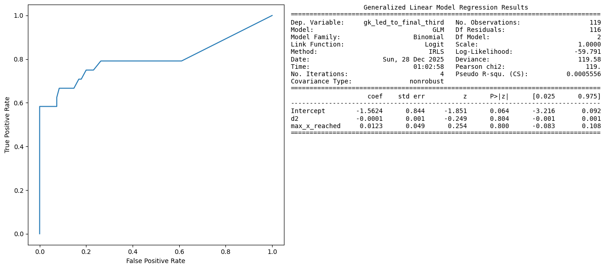
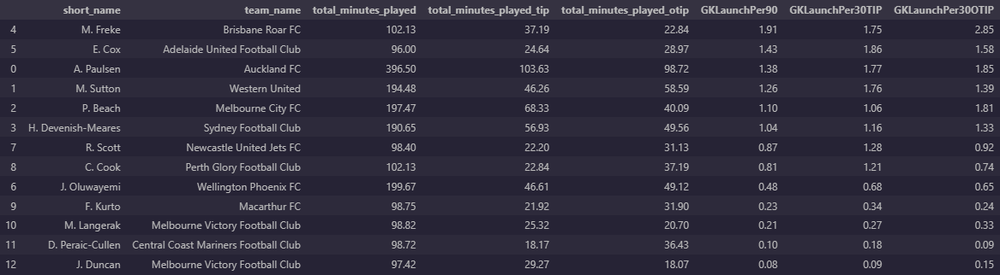

# SkillCorner X PySport Analytics Cup
This repository contains the submission template for the SkillCorner X PySport Analytics Cup **Research Track**. 
Your submission for the **Research Track** should be on the `main` branch of your own fork of this repository.

Find the Analytics Cup [**dataset**](https://github.com/SkillCorner/opendata/tree/master/data) and [**tutorials**](https://github.com/SkillCorner/opendata/tree/master/resources) on the [**SkillCorner Open Data Repository**](https://github.com/SkillCorner/opendata).

## Submitting
Make sure your `main` branch contains:
1. A single Jupyter Notebook in the root of this repository called `submission.ipynb`
    - This Juypter Notebook can not contain more than 2000 words.
    - All other code should also be contained in this repository, but should be imported into the notebook from the `src` folder.
2. An abstract of maximum 500 words that follows the **Research Track Abstract Template**.
    - The abstract can contain a maximum of 2 figures, 2 tables or 1 figure and 1 table.
3. Submit your GitHub repository on the [Analytics Cup Pretalx page](https://pretalx.pysport.org)

Finally:
- Make sure your GitHub repository does **not** contain big data files. The tracking data should be loaded directly from the [Analytics Cup Data GitHub Repository](https://github.com/SkillCorner/opendata).For more information on how to load the data directly from GitHub please see this [Jupyter Notebook](https://github.com/SkillCorner/opendata/blob/master/resources/getting-started-skc-tracking-kloppy.ipynb).
- Make sure the `submission.ipynb` notebook runs on a clean environment.

_⚠️ Not adhering to these submission rules and the [**Analytics Cup Rules**](https://pysport.org/analytics-cup/rules) may result in a point deduction or disqualification._

---

## Research Track Abstract Template (max. 500 words)
## GKLaunch: Measuring Significant Goalkeepers Contributions in the Attacking Phases
#### Introduction

Nowadays, the contributions of the goalkeepers to the overall team performance have transcended the shots blocking or sweeping skills. Goalkeepers from various teams of the most competitive leagues in the world (for example Liverpool's Alisson or Man City's Ederson) started to get more active during the build-up, and even provide key passes and assists from their own box. Using tracking data and the dynamic events, we identify and create a predictive metric called **GKLaunch**, which focuses on the efficiency of a goalkeeper that starts a possession chain that eventually ends in the attacking final third, whether it ends with a shot, a goal, or with any other event.

#### Methods

The input data required for this project combines the tracking and players possessions data. To include details regarding the minutes played, the matches metadata are also processed. For each match, we tag the possession chains and then we look for the possession chains that are started from a goalkeeper that reach the attacking final third. General information, pitch coordinates, the starting and ending areas or information about the outcome were encapsulated in a dataset that was later used to create the model features. **119** chains out of 9566 were started by a keeper, and around a fifth of them (24) reached the attacking third. Out of those, 6 finished in a shot, and one resulted in a goal. Using the Generalized Linear Model function from the statsmodel library, the most statistically relevant features were the distance squared and the the maximum forward distance reached. Given that the problem was reduced to a binary classification (if the goalkeeper-led chain ended in the attacking third or not), the Random Forest classifier from the scikit-learn library was used.

#### Results

Two thirds of the data was used for training, while the remaining third was used for testing. The obtained predictions were then evaluated using the ROC score and the ROC-AUC curve, and the model registered solid scores between 80% and 85%, given the data quantity.

The GKLaunch values were then normalized in three ways: per 90 minutes, per 30 minutes TIP (team in possession) and OTIP (out of team in possession). Out of 13 goalkeepers, 8 of them registered approximately or more than one such "launch" per 90 minutes, with Macklin Freke being the sole keeper with about two "launches" per 90 minutes.

#### Conclusion

In this project, a metric was presented with the aim of predicting how often a goalkeeper starts a possession that ends up in the attacking third. In the future, it can be refined by adding more context: how the goalkeeper recovered the ball or the off-ball opposition defensive structures could present some relevant features. Goalkeepers that are able to "launch" their teammates like this could possess a valuable asset. If the vision of a team would include having an 'attacking' goalkeeper, this metric can be used and even improved to profile the existing ones or even look for new keepers.
